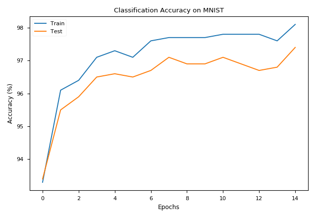
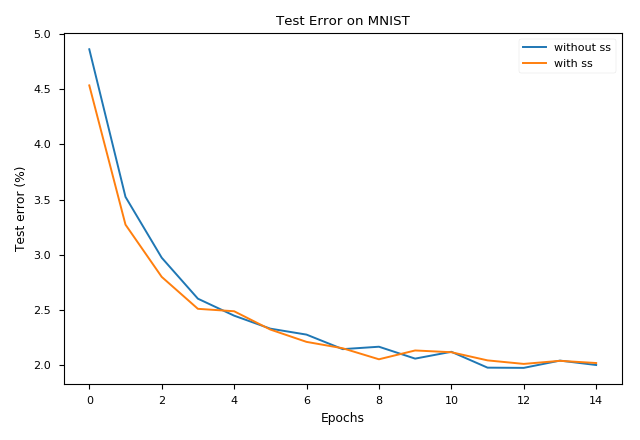

# DeepLearing
Deep learning related topics.

## Bayes by Backprop (BBB)

An implementation of the *Bayes by Backprop* algorithm presented in the paper ["Weight Uncertainty in Neural Networks"](https://arxiv.org/abs/1505.05424) on the MNIST dataset using PyTorch. Here we use a scaled mixture Gaussian prior.

As you can see from the plot, bayes by backprop prevents overfitting reaching final test accuracy around 97.4% (97% is apprixmately the limit of feedforward neural networks on MNIST while conv nets can reach about 99.7% accuracy).

My implementation differs from the one described in the paper in the following ways:

1. Instead of sampling Gaussian noise at every step (which can be very slow), we instantiate a huge block of Gaussian noise at the begining and sample from it. This means the Gaussian noise sampled are not strictly indenpendent, but didn't find it to be an issue.
2. Use a *symmetric sampling* technique to reduce variance. That is, we always sampling paired Gaussian noise which differ only by a negative sign. Since doing so added some complexity in the code, I saved it to another file: `bayes_by_backprop_ss.py`.

Here is a comparison between using and not using symmetric sampling. To make it a fair fight, we take 2 samples from the posterior when we not using symmetric sampling.

Test error with and without symmetric sampling are around 2.2%, respectively. With symmetric sampling, learning converges faster but the untimate result is similar to their random sampling counterpart.

**Update:** I refine the code and employ the local reparametrization trick presented in the paper [*"Variational Dropout and the Local Reparameterization Trick"*](https://arxiv.org/abs/1506.02557), which gives you higher computational efficiency and lower variance gradient estimates. I separate them into three files:

1. `BNNLayer.py` contains a Bayesian layer class.
2. `BNN.py` contains a Bayesian neural network class.
3. `bnn_mnist.py` = MNIST data from `torchvision` + training process.